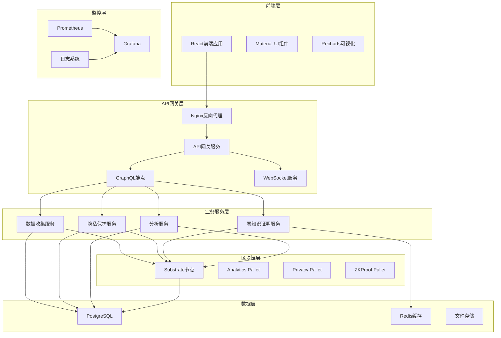
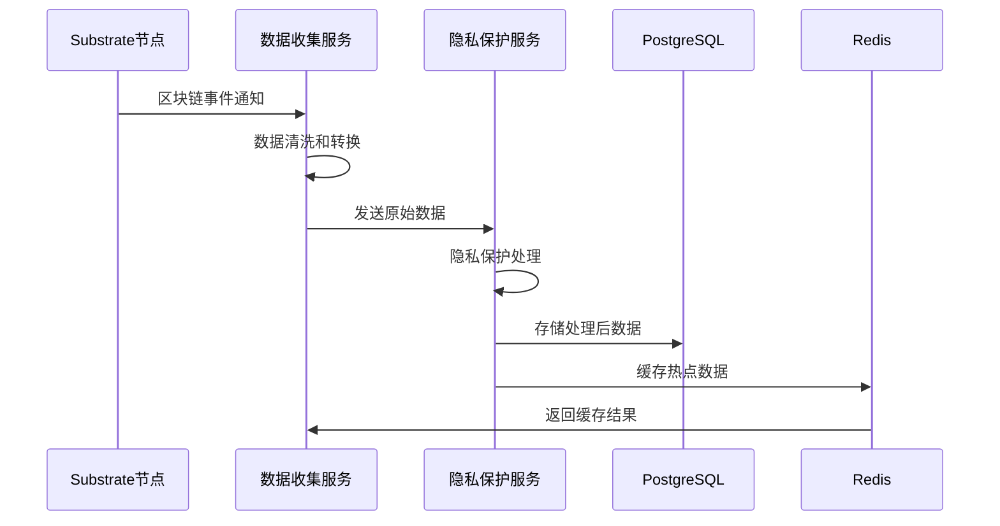
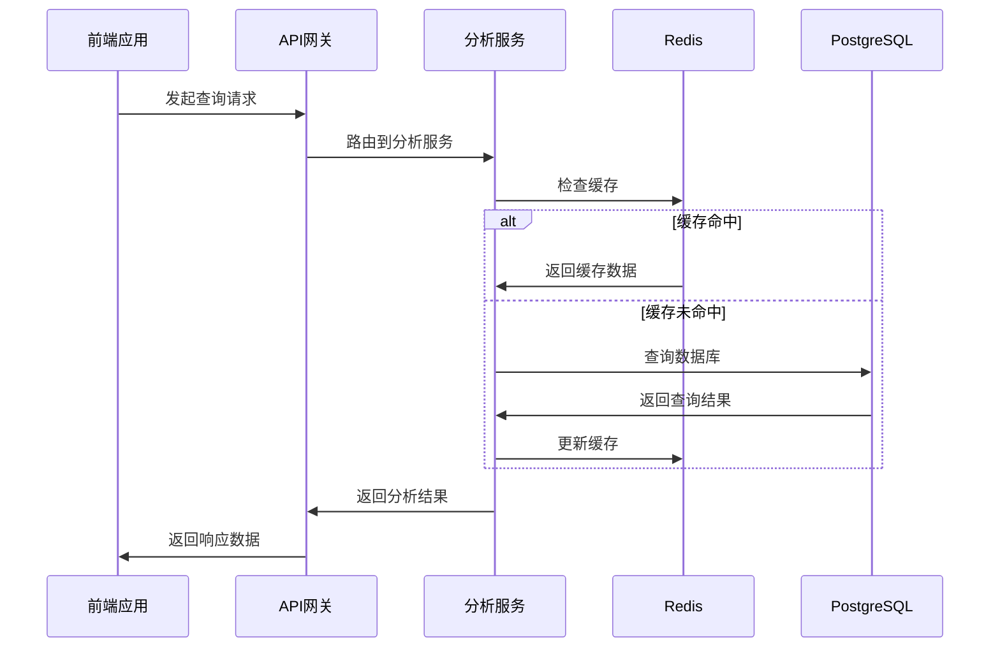

# PolyVisor 系统架构文档

## 🏗️ 系统概览

PolyVisor是一个基于Substrate的隐私保护Polkadot网络分析平台，采用微服务架构和模块化设计。

## 📊 整体架构图



## 🔧 技术栈

### 区块链层
- **Substrate 3.0** - 区块链开发框架
- **FRAME Pallets** - 模块化运行时组件
- **Rust** - 系统编程语言
- **WebAssembly** - 运行时执行环境

### 后端服务
- **Axum** - Rust Web框架
- **tokio** - 异步运行时
- **sqlx** - 数据库访问层
- **async-graphql** - GraphQL服务器
- **tonic** - gRPC服务框架

### 前端应用
- **React 18** - 用户界面框架
- **TypeScript** - 类型安全的JavaScript
- **Material-UI v5** - 组件库
- **Recharts** - 数据可视化
- **React Router** - 路由管理

### 数据存储
- **PostgreSQL 15** - 主数据库
- **Redis 7** - 缓存和会话存储
- **IPFS** - 分布式文件存储

### 基础设施
- **Docker** - 容器化
- **Kubernetes** - 容器编排
- **Nginx** - 反向代理和负载均衡
- **Prometheus** - 监控和指标收集
- **Grafana** - 监控可视化

## 🏛️ 架构层次

### 1. 表现层 (Presentation Layer)
```
┌─────────────────────────────────────┐
│           Web前端应用                │
├─────────────────────────────────────┤
│ • React单页应用                     │
│ • 响应式UI设计                      │
│ • 实时数据可视化                    │
│ • 用户交互界面                      │
└─────────────────────────────────────┘
```

### 2. API网关层 (API Gateway Layer)
```
┌─────────────────────────────────────┐
│           API网关服务                │
├─────────────────────────────────────┤
│ • REST API端点                      │
│ • GraphQL查询接口                   │
│ • WebSocket实时通信                 │
│ • 请求路由和负载均衡                │
│ • 身份验证和授权                    │
│ • 限流和监控                        │
└─────────────────────────────────────┘
```

### 3. 业务逻辑层 (Business Logic Layer)
```
┌─────────────────┬─────────────────┬─────────────────┐
│   数据收集服务   │   隐私保护服务   │   分析计算服务   │
├─────────────────┼─────────────────┼─────────────────┤
│ • 区块链数据采集 │ • 差分隐私算法   │ • 统计分析计算   │
│ • 实时数据监控   │ • 数据匿名化处理 │ • 预测模型计算   │
│ • 数据清洗转换   │ • K-匿名性保证   │ • 趋势分析算法   │
│ • 指标计算聚合   │ • 零知识证明生成 │ • 异常检测算法   │
└─────────────────┴─────────────────┴─────────────────┘
```

### 4. 区块链层 (Blockchain Layer)
```
┌─────────────────────────────────────┐
│         Substrate区块链节点          │
├─────────────────────────────────────┤
│ Runtime模块:                        │
│ • Analytics Pallet - 数据分析       │
│ • Privacy Pallet - 隐私保护         │
│ • ZKProof Pallet - 零知识证明       │
│ • Governance Pallet - 治理机制      │
└─────────────────────────────────────┘
```

### 5. 数据持久层 (Data Persistence Layer)
```
┌─────────────────┬─────────────────┬─────────────────┐
│   PostgreSQL    │     Redis       │   文件存储       │
├─────────────────┼─────────────────┼─────────────────┤
│ • 结构化数据存储 │ • 缓存热点数据   │ • 静态资源文件   │
│ • 事务性数据处理 │ • 会话状态管理   │ • 日志文件存储   │
│ • 复杂查询支持   │ • 消息队列服务   │ • 备份文件管理   │
│ • 数据一致性保证 │ • 分布式锁服务   │ • 大文件存储     │
└─────────────────┴─────────────────┴─────────────────┘
```

## 🔄 数据流架构

### 数据采集流程


### 查询处理流程


## 🔐 安全架构

### 多层安全防护
```
┌─────────────────────────────────────┐
│            网络安全层                │
├─────────────────────────────────────┤
│ • HTTPS/TLS加密传输                 │
│ • WAF Web应用防火墙                 │
│ • DDoS攻击防护                      │
│ • IP白名单和黑名单                  │
└─────────────────────────────────────┘

┌─────────────────────────────────────┐
│            应用安全层                │
├─────────────────────────────────────┤
│ • JWT身份验证                       │
│ • 基于角色的访问控制                │
│ • API限流和熔断                     │
│ • 输入验证和防注入                  │
└─────────────────────────────────────┘

┌─────────────────────────────────────┐
│            数据安全层                │
├─────────────────────────────────────┤
│ • 数据库连接加密                    │
│ • 敏感数据字段加密                  │
│ • 数据备份加密                      │
│ • 访问日志审计                      │
└─────────────────────────────────────┘

┌─────────────────────────────────────┐
│            隐私保护层                │
├─────────────────────────────────────┤
│ • 零知识证明验证                    │
│ • 差分隐私算法                      │
│ • 数据匿名化处理                    │
│ • K-匿名性保证                      │
└─────────────────────────────────────┘
```

## 📈 性能架构

### 性能优化策略
1. **缓存策略**
   - Redis多级缓存
   - CDN静态资源缓存
   - 浏览器缓存优化

2. **数据库优化**
   - 索引优化
   - 查询优化
   - 读写分离
   - 分库分表

3. **异步处理**
   - 消息队列解耦
   - 异步任务处理
   - 批量数据处理

4. **负载均衡**
   - 服务实例扩展
   - 请求负载分发
   - 故障自动切换

### 可扩展性设计
- **水平扩展**: 微服务无状态设计
- **垂直扩展**: 资源配置动态调整
- **弹性伸缩**: 基于负载自动扩缩容
- **跨区域部署**: 多数据中心容灾

## 🔧 部署架构

### 容器化部署
```yaml
# Docker Compose服务编排
services:
  - substrate-node     # 区块链节点
  - api-gateway       # API网关
  - data-collector    # 数据收集服务
  - privacy-service   # 隐私保护服务
  - zkproof-service   # 零知识证明服务
  - analytics-service # 分析服务
  - frontend          # 前端应用
  - postgres          # 数据库
  - redis            # 缓存
  - nginx            # 反向代理
  - prometheus       # 监控
  - grafana          # 可视化
```

### Kubernetes部署
```yaml
# K8s资源配置
apiVersion: v1
kind: Namespace
metadata:
  name: polyvisor
---
# 部署配置、服务、ConfigMap、Secret等
```

## 📊 监控架构

### 监控指标体系
1. **基础设施监控**
   - CPU、内存、磁盘使用率
   - 网络带宽和延迟
   - 容器运行状态

2. **应用性能监控**
   - 接口响应时间
   - 错误率和成功率
   - 并发用户数

3. **业务指标监控**
   - 数据采集量
   - 隐私保护处理量
   - 用户活跃度

### 告警机制
- **阈值告警**: 基于指标阈值触发
- **异常检测**: 基于机器学习的异常识别
- **业务告警**: 关键业务流程监控
- **多渠道通知**: 邮件、短信、即时消息

---

📖 **更新说明**: 该架构文档会随着系统演进持续更新，请关注版本变更。